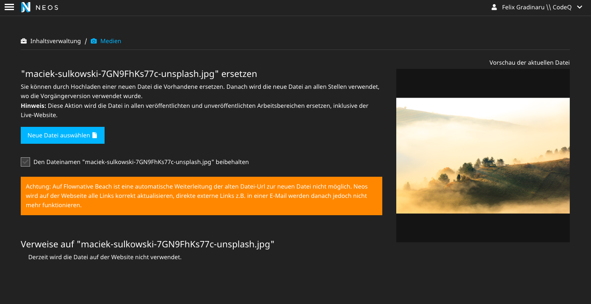

# CodeQ.BeachAssetRedirectionWarning

[Flownative Beach](https://www.flownative.com/en/products/beach.html) does not support asset url redirects.
To make editors aware of that, this package replaces the
`ReplaceAssetResource` template in `Neos.Media.Browser`
to show a warning that asset redirections do not work.

The package also removes the checkbox to create a redirect,
thus no redirect will be created even if `Neos.RedirectHandler`
is installed.

:warning: The package will only be effective if the context starts with **Production/Beach**, which is the usual default for Flownative Beach.

## Further Development

* The package is currently only available in German and hard-coded. Further versions may implement other translations. Pull requests are welcome.

## Credits

* The development and the public-releases of this package are generously sponsored by [Code Q Web Factory](http://codeq.at).
* The template file is taken from the [Neos.io project](https://github.com/neos/neos-development-collection/blob/8.2/Neos.Media.Browser/Resources/Private/Templates/Asset/ReplaceAssetResource.html) and modified
* Example image by Maciek Sulkowski from Unsplash (https://unsplash.com/photos/7GN9FhKs77c)

## Authors

* [Felix Gradinaru (Code Q)](mailto:fg@codeq.at)
